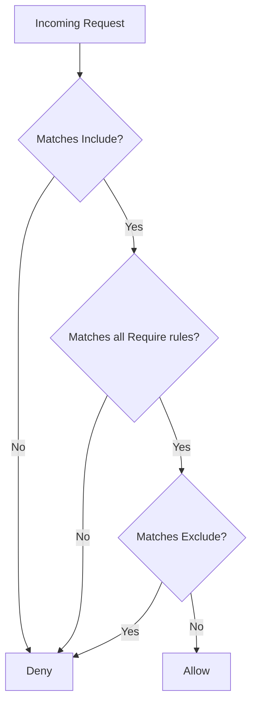

# Policy Evaluation

```mermaid
flowchart TB
    Request[Incoming Request]
    Include{Matches Include?}
    Require{Matches all Require rules?}
    Exclude{Matches Exclude?}
    Allow[Allow]
    Deny[Deny]

    Request --> Include
    Include -->|No| Deny
    Include -->|Yes| Require
    Require -->|No| Deny
    Require -->|Yes| Exclude
    Exclude -->|Yes| Deny
    Exclude -->|No| Allow
```
